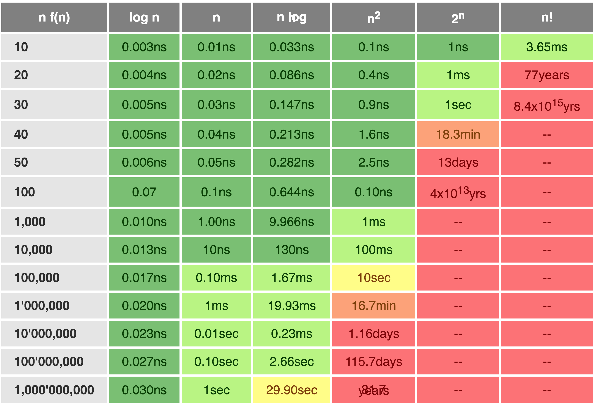

# Algorithm complexity

central problem: get a feel for execution speed as a function of input size rather than just a single run and, importantly, independent of machine speed, compare two alg w/o worrying about impl details such as machine size, prog lang, optimizations.

worst case vs best vs average

asymp behavior. n^2 + n is n^2. kn is n

or memory footprint

brute force vs alg to improve on that

measure with T(n) = ..., T(0)=0 or T(1)=0 as initial condition

for loop lin search: T(n) = n x k => O(n)

recursive lin search: T(n) = 1 + T(n-1) = 1 + 1 + T(n-2) = n x 1 + T(0) = n x 1

can measure time or space

what are we counting as a unit of work? float ops? comparisons? swaps? touching nodes?

what are the key vars of problem size? n? n, m?

common: 1, logn, n, nlogn, n^2

From https://medium.freecodecamp.org/my-first-foray-into-technology-c5b6e83fe8f1

From http://cooervo.github.io/Algorithms-DataStructures-BigONotation/index.html:

