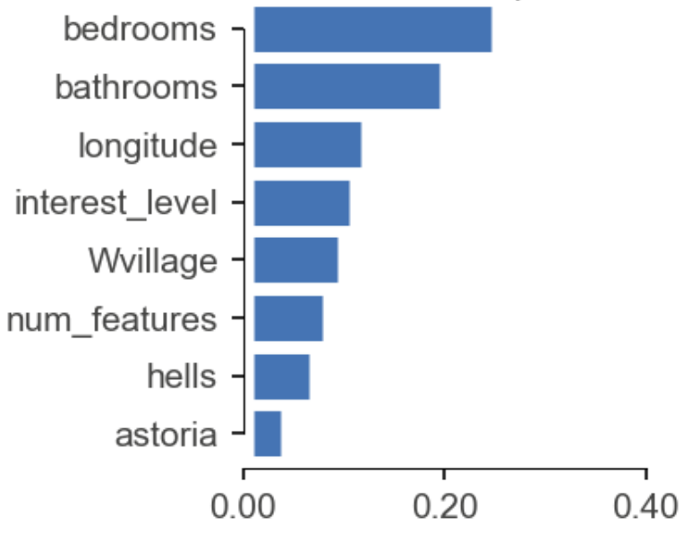
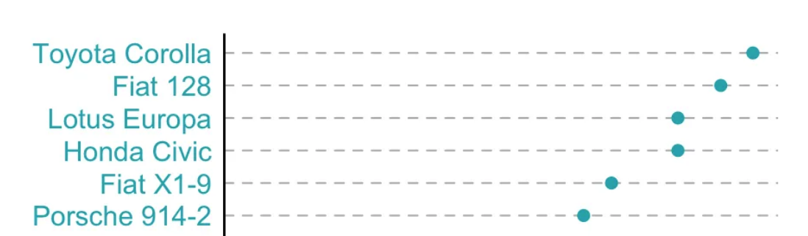
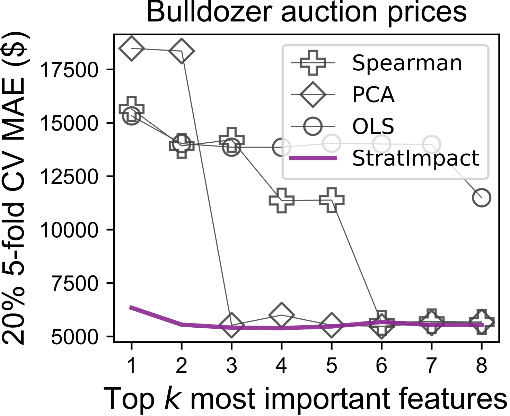
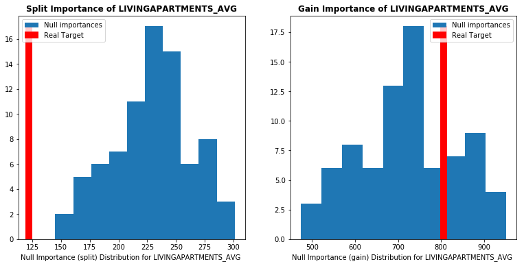

# Feature importance and selection

The goal of this project is to get a much stronger understanding of the various feature importance algorithms and how to select features in a model. As with your second project, this project is very loosely defined and you must generate a report summarizing your techniques and explorations in a notebook that you would be proud to send a potential employer. (*But, please don't post your results publicly on the Internet as I will likely use these projects in the future*.)

You will work under `featimp-`*userid* repo and create a support file called `featimp.py` that you can import into your notebook using the following from one of the cells:

```
%run featimp
```

That way you can keep big chunks of functions out of your notebook and the notebook can be primarily about explanations and visualizations. (You can link to the code from the notebook of course.)

**Warning:** You must implement your own code here, despite there being implementations available for you to read on the Internet. The goal is for you to learn as much as possible from this course. You will get out of this what you put into it.

## Importance strategies working directly from the data

The simplest technique to identify important regression features is to rank them by their Spearman's rank correlation coefficient; the feature with the largest coefficient is taken to be the most important. This method is measuring *single-feature relevance importance* and works well for independent features, but suffers in the presence of codependent features.   Groups of features with similar relationships to the response variable receive the same or similar ranks, even though just one should be considered important.

Another possibility is to use principle component analysis (PCA), which operates on just the X explanatory matrix. PCA transforms data into a new space characterized by eigenvectors and identifies features that explain the most variance in the new space. If the first principal component covers a large percentage of the variance, the "loads" associated with that component can indicate importance of features in the original X space.

In an effort to deal with codependencies, data analysis techniques rank features not just by *relevance* (correlation with the response variable) but also by low *redundancy*, the amount of information shared between codependent features, which is the idea behind [minimal-redundancy-maximal-relevance](http://home.penglab.com/papersall/docpdf/2005_TPAMI_FeaSel.pdf) (mRMR):


The *I* function that measures the association between variables can be many things, but people have tried mutual information and simple correlation coefficient. I recommend Spearman's rank coefficient but you are free to try all sorts of other things.

You might find these [slides on feature importance](http://www.robots.ox.ac.uk/~davidc/pubs/CDT-B1-Lecture12-MondayWeek2-FeatureSelection2.pdf) useful. Also, here is an example [use of mRMR from Uber](https://arxiv.org/pdf/1908.05376.pdf).  Here's a [sample implementation](https://github.com/danielhomola/mifs/blob/master/mifs/mifs.py) and [some functions for mutual information](https://gist.github.com/GaelVaroquaux/ead9898bd3c973c40429), if you want to go that route.

## Visualizing importances

You should try to come up with a good way to visualize the featured importances. What I have is pretty clunky:



I'm sure something better could be done. For example, from [this blog post](https://www.r-bloggers.com/bar-plots-and-modern-alternatives/):


 
## Model-based importance strategies

The default future importance that uses so-called *gini drop* for random forests in the sklearn lib is known to be biased. You will want to check out [Beware Default Random Forest Importances](https://explained.ai/rf-importance/index.html), which I wrote with Jeremy Howard and two previous students. The result of that article became the [rfpimp package](https://github.com/parrt/random-forest-importances), which contains simple implementations for:
 
* permutation importance
* drop column importance

which we discussed in the introduction to machine learning course. It's easy and fun to implement those so you should do that.


## Comparing strategies

 Because we as humans cannot simply look at the data and decide which features are most important, we often just rely on testing how well the recommended features work for a variety of models. For example, given a feature ranking, we can train OLS, RF, and XGBoost models on the top *k=1..p* features to see how good those features are.  For example, on the bulldozer data set for a new technique I'm working on, I generate a graph that looks like this:
 


That compares Spearman's rank coefficient, PCA, and linear regression.

You should also add compare to [shap](https://github.com/slundberg/shap) to your comparisons to see how well the techniques you implement do in relation to shap.

You can make a different graph for top-*k* as tested with OLS, RF, and XGBoost. It's often the case that features determined for one model do not export well to other models.
 
## Automatic feature selection algorithm

Once you have an ordering of features from most to least important, we need a mechanism to drop off unimportant features and keep the top *k*, for some *k* we don't know beforehand. Implement an automated mechanism that selects the top *k* features automatically that gives the best validation error. In other words, get a baseline validation metric appropriate for a classifier or a regressor then get the feature importances. Dropped the lowest importance feature and retrain the model and re-computing the validation metric. If the validation metric is worse, then we have dropped one too many features. Because of codependencies between features, you must recompute the feature importances after dropping each feature.

In your report, you should make it clear how the algorithm works and the results. That means you will have to come up with a way to visualize or describe the results.

## Variance and empirical p-values for feature importances

Given a mechanism to compute feature importances, you can get several results by bootstrapping the X,y data. That means that you can compute variance or standard deviation of the feature importances. That is a very useful thing to have. For example, here are some error bars from the rent data set that represent two standard deviations:


Make sure to normalize your future importances to the same range so that the variance is comparable.

It's also useful to get p-values to know whether a feature's importance is significant. To do that, we need a null distribution for comparison purposes. In other words, how likely is a feature to give the real feature importance by accident or randomly?   The idea is to shuffle the target variable y, and then compute the feature importances again.   Count how many times a feature is as important or more important than the true future importance computed as a baseline. If that percentage gets above say 5%, then that feature importance is not significant. I had to run the simulations about 80 times before I started getting reasonable results. This will take a while. ;)  As a starting point, you can check out this [kaggle notebook on null distributions](https://www.kaggle.com/ogrellier/feature-selection-with-null-importances). Here is one of his visualizations of a feature that is significant and one that is not:



## Deliverables

1. File `featimp.py` in the root directory of your repository.  This should include all of your algorithm implements and support code.
2. Notebook called `featimp.ipynb` and associated PDF generated from it called `featimp.pdf`. The notebook is really more like a report than a dump of your code.

## Assessment

I believe I will have help with a grader, but reading your reports will take significantly longer than when I provide you some unit tests. Sorry in advance. Also, given the wide range of reports that you will submit, I will limit myself to one of three grades check minus, check, check plus, corresponding roughly to C, B, A.

You should also think about explaining how all of your algorithms work and include a discussion of what you learned or questions you answered. Talk about any extra stuff you've done and other tests. Ask yourself what you don't know and what you'd like to learn at the start of this project. Then those are good questions to ask and answer in your report notebook. Try to create something that you will be proud to show potential employers.

You should submit a well-written and well-organized report, not a junk drawer of crap you were working on when the deadline hit. ;)