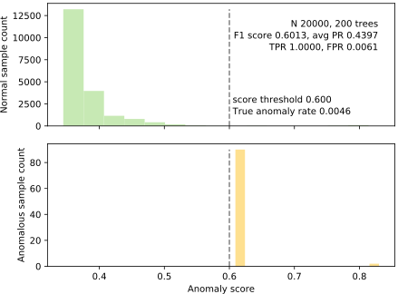
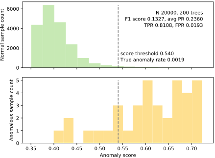
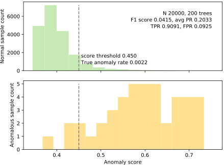
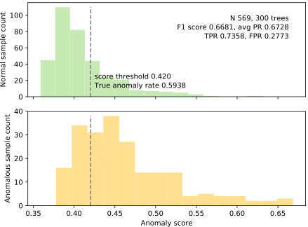
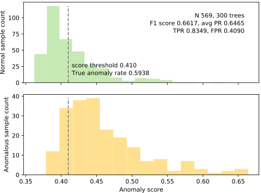
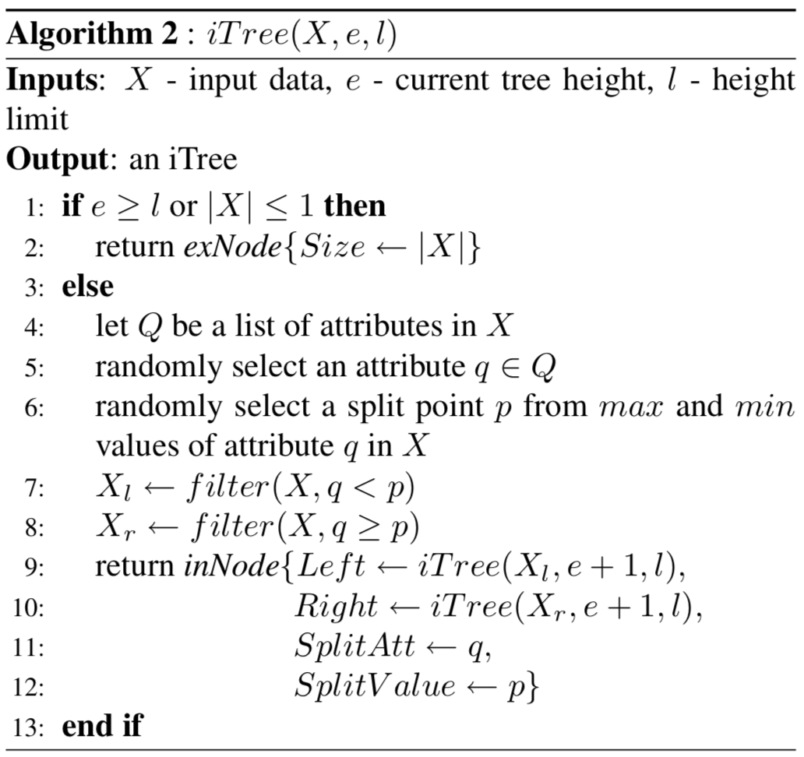
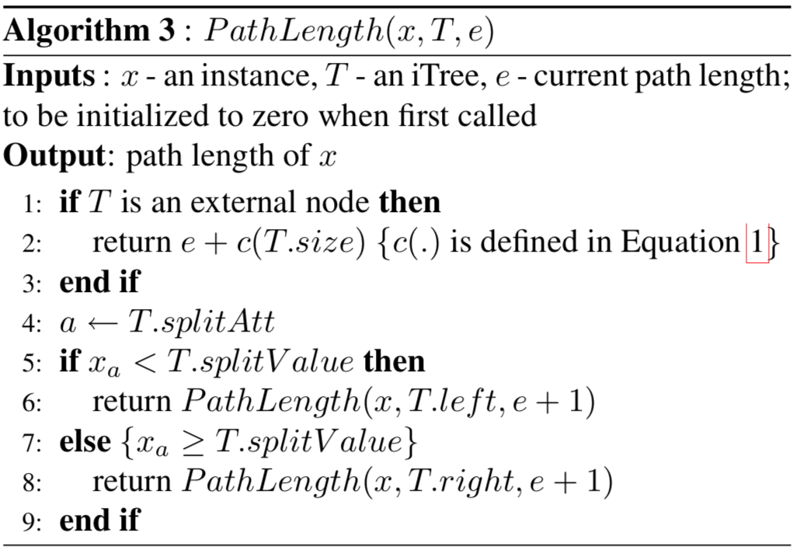
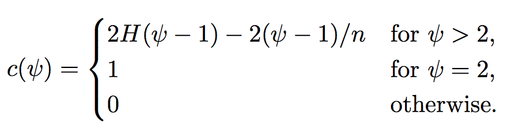
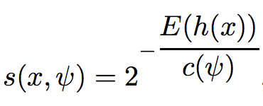

# Isolation Forest Implementation


The goal of this project is to implement the original [Isolation Forest](IsolationForestPaper.pdf) algorithm by Fei Tony Liu, Kai Ming Ting, and Zhi-Hua Zhou.  (A later version of this work is also available: [Isolation-based Anomaly Detection](http://citeseerx.ist.psu.edu/viewdoc/download?doi=10.1.1.673.5779&rep=rep1&type=pdf).) There are two general approaches to anomaly detection: 

1. model what normal looks like and then look for nonnormal observations
2. focus on the anomalies, which are few and different. This is the interesting and relatively-new approach taken by the authors of isolation forests.

The isolation forest algorithm is original and beautiful in its simplicity; and also seems to work very well, with a few known weaknesses. The academic paper is extremely readable so you should start there.

I have provided some useful code to test and plot the results of your implementation.

**WARNING**: There are sample implementations out there. I will be using [MOSS](https://theory.stanford.edu/~aiken/moss) to compare your programs together and against the known implementations. For example, here are two sample implementations:  [mgckind/iso_forest at github](https://github.com/mgckind/iso_forest/blob/master/iso_forest.py) and [Unsupervised Fraud Detection: Isolation Forest at Kaggle](https://www.kaggle.com/rgaddati/unsupervised-fraud-detection-isolation-forest). You may read these but absolutely no copying. You must learn to implement recursive tree algorithms yourself.

## Data sets

For this project, we'll use three data sets:

* [Kaggle credit card fraud competition data set](https://www.kaggle.com/mlg-ulb/creditcardfraud); download, unzip to get `creditcard.csv`

* Get cancer data into `cancer.csv` by executing [savecancer.csv](https://github.com/parrt/msds689/blob/master/projects/iforest/savecancer.py) that I provide.

* [http.zip](https://github.com/parrt/msds689/blob/master/projects/iforest/http.zip); download, unzip to get `http.csv`.

These files are not that large, but a pure Python solution for isolation forest takes too long on the whole file: 2.5 minutes on `creditcard.csv` and 5 minutes on `http.csv`.  (My hybrid python/C solution takes about two seconds. ha!)

My code assumes the data files are in the same directory as the code.

## Visualization of normal versus anomaly separation

Using [plot_anomalies.py](https://github.com/parrt/msds689/blob/master/projects/iforest/plot_anomalies.py), which I provide for you, you can see the results of the isolation forest trying to detect anomalies. These data sets all have known targets indicating normal versus anomaly, but this information is only used during testing and not during training. In other words, we use this information to discover how well we can separate the distribution of normal versus anomalous observations.  The section provides a number of results, but yours might look different because of the inherent randomness involved in selecting subsets of the data and constructing random trees. (click on the images to enlarge.)

<center>
<table border="0">
<tr><td>http.csv, 200 trees, 99% desired TPR</td></tr>
<tr>
<td border=0>
<a href="images/http-200-99.svg"></a>
</tr>
</table>
</center>

<table border="0">
<tr><td>creditcard.csv, 200 trees, 80% desired TPR</td><td>creditcard.csv, 200 trees, 90% desired TPR</td></tr>
<tr>
<td border=0>
<a href="images/creditcard-200-80.svg"></a>
<td border=0>
<a href="images/creditcard-200-90.svg"></a>
</tr>
</table>

<table border="0">
<tr><td> cancer, 300 trees, 70% desired TPR</td><td> cancer, 300 trees, 80% desired TPR</td></tr>
<tr>
<td border=0>
<a href="images/cancer-300-70.svg"></a>
<td border=0>
<a href="images/cancer-300-80.svg"></a>
</tr>
</table>

## Algorithm

For your convenience, here are the algorithms extracted from the Liu *et al* paper:

<table border="0">
<tr>
<td width="50%" valign="top"></td><td width="50%" valign="top"></td>
</tr>
<tr>
<td valign="top">

</td>
<td valign="top">
Please use this version of average path length <tt>c()</tt>, not the one in the original paper:<br>


<p>Then finally here's the scoring formula:<br>



<p>where "<i>H(i)</i> is the harmonic number and it can be estimated by <i>ln(i)</i> + 0.5772156649 (Euler’s constant)."
</td>
</tr>
</table>


You also have to compute the number of nodes as you construct trees. The scoring test rig uses tree field `n_nodes`:

```python
n_nodes = sum([t.n_nodes for t in it.trees])
print(f"INFO {datafile} {n_nodes} total nodes in {n_trees} trees")
```

## The required API

Your implementation must be in a file called `iforest.py` and define the following classes and methods

```python
class IsolationTreeEnsemble:
    def __init__(self, sample_size, n_trees=10):
        ...
        
    def fit(self, X:np.ndarray, improved=False):
        """
        Given a 2D matrix of observations, create an ensemble of IsolationTree
        objects and store them in a list: self.trees.  Convert DataFrames to
        ndarray objects.
        """
        if isinstance(X, pd.DataFrame):
            X = X.values
        ...
        return self

    def path_length(self, X:np.ndarray) -> np.ndarray:
        """
        Given a 2D matrix of observations, X, compute the average path length
        for each observation in X.  Compute the path length for x_i using every
        tree in self.trees then compute the average for each x_i.  Return an
        ndarray of shape (len(X),1).
        """
        if isinstance(X, pd.DataFrame):
            X = X.values
        ...

    def anomaly_score(self, X:np.ndarray) -> np.ndarray:
        """
        Given a 2D matrix of observations, X, compute the anomaly score
        for each x_i observation, returning an ndarray of them.
        """
        ...

    def predict_from_anomaly_scores(self, scores:np.ndarray, threshold:float) -> np.ndarray:
        """
        Given an array of scores and a score threshold, return an array of
        the predictions: 1 for any score >= the threshold and 0 otherwise.
        """
        ...

    def predict(self, X:np.ndarray, threshold:float) -> np.ndarray:
        "A shorthand for calling anomaly_score() and predict_from_anomaly_scores()."
        ...
```

```python
class IsolationTree:
    def __init__(self, height_limit):
        ...

    def fit(self, X:np.ndarray, improved=False):
        """
        Given a 2D matrix of observations, create an isolation tree. Set field
        self.root to the root of that tree and return it.

        If you are working on an improved algorithm, check parameter "improved"
        and switch to your new functionality else fall back on your original code.
        """
        ...
        return self.root
```

You will need either a single tree node definition, or one for decision nodes and one for leaves. That implementation detail up to you. (I don't think that the type of the nodes is exposed to the support code I provide, but let me know if it is.)

You also need to implement a function used by the scoring test rig:
 
```python
def find_TPR_threshold(y, scores, desired_TPR):
    """
    Start at score threshold 1.0 and work down until we hit desired TPR.
    Step by 0.01 score increments. For each threshold, compute the TPR
    and FPR to see if we've reached to the desired TPR. If so, return the
    score threshold and FPR.
    """
    ...
    return threshold, FPR
```


## Scoring results

Using [score.py](https://github.com/parrt/msds689/blob/master/projects/iforest/score.py), here is a sample run:

```
Running noise=False improved=False
INFO creditcard.csv fit time 0.23s
INFO creditcard.csv 18804 total nodes in 200 trees
INFO creditcard.csv score time 14.54s
SUCCESS creditcard.csv 200 trees at desired TPR 80.0% getting FPR 0.0300%

INFO http.csv fit time 0.28s
INFO http.csv 22430 total nodes in 300 trees
INFO http.csv score time 23.08s
SUCCESS http.csv 300 trees at desired TPR 99.0% getting FPR 0.0053%

INFO cancer.csv fit time 0.08s
INFO cancer.csv 8204 total nodes in 1000 trees
INFO cancer.csv score time 0.73s
SUCCESS cancer.csv 1000 trees at desired TPR 75.0% getting FPR 0.2857%
```

Due to the subsampling of the original data said and the inherent random nature of isolation forest, your results will differ even from run to run.  I'm hoping that the variance is not so high that valid programs fail the scoring, but let me know.

The indicated required score values were set using my machine and my implementation. Then I gave a range above that that are still considered to be valid.

## Improving on the original algorithm

One of the known weaknesses of the original isolation forest is that it can't handle lots of irrelevant or noisy features (columns).  If you'd like to add noise to see how your algorithm performs, turn on commandline parameter `-noise`. With 5 noise columns, here's what one of my sample runs looks like:

```
Running noise=True improved=False
INFO creditcard.csv fit time 0.24s
INFO creditcard.csv 18742 total nodes in 200 trees
INFO creditcard.csv score time 15.19s
SUCCESS creditcard.csv 200 trees at desired TPR 80.0% getting FPR 0.0360%

INFO http.csv fit time 0.38s
INFO http.csv 31522 total nodes in 300 trees
INFO http.csv score time 24.37s
FAIL http.csv FPR 0.1151 > 0.006 +- 30%
FAIL http.csv n_nodes 31522 > 22700 +- 20%
ERRORS http.csv 2 errors 300 trees at desired TPR  99.0% getting FPR 0.1151%

INFO cancer.csv fit time 0.09s
INFO cancer.csv 8236 total nodes in 1000 trees
INFO cancer.csv score time 0.81s
SUCCESS cancer.csv 1000 trees at desired TPR 75.0% getting FPR 0.2521%
```

Notice that it is starting to fail because of poor performance.

The scoring mechanism knows how to switch mechanisms through the use of the command line option `-improved`.  My improved algorithm with 5 noise columns, looks like this:

```
Running noise=True improved=True
INFO creditcard.csv fit time 0.25s
INFO creditcard.csv 15920 total nodes in 200 trees
INFO creditcard.csv score time 14.66s
SUCCESS creditcard.csv 200 trees at desired TPR 80.0% getting FPR 0.0224%

INFO http.csv fit time 0.40s
INFO http.csv 26464 total nodes in 300 trees
INFO http.csv score time 24.28s
SUCCESS http.csv 300 trees at desired TPR 99.0% getting FPR 0.0091%

INFO cancer.csv fit time 0.15s
INFO cancer.csv 7718 total nodes in 1000 trees
INFO cancer.csv score time 0.82s
SUCCESS cancer.csv 1000 trees at desired TPR 75.0% getting FPR 0.2857%
```

###  Reducing noise sensitivity

The scoring mechanism is sensitive to the improved algorithm and is a bit more relaxed because it knows the improved algorithm is trying to work on noisy columns.

You have a number of options for trying to improve the algorithm. The authors suggest computing and sorting by feature kurtosis then using a subset of those features during training.   Because we know how many features are original and how many are noise, this will probably work. But, in general, we would not know how many of our features are irrelevant so this approach might not work. Also it will significantly impact your training time I would say.

Another approach involves trying to select features during training when you split at decision nodes. Think about how you might decide whether one candidate (column and split value) is better than another. How would you decide what the candidates are? I've determined that there is a mechanism here that holds great promise, as you can see from my test results running with noise and the improved algorithm.

Let's see how well you can do!!!

### Increasing speed

I also think that speed will be a problem for your first implementation. See how fast you can get `path_length()` and see if you can beat my speed! To go much faster than I have in `score.py`, I had to rely on [Cython](https://cython.org/) for a 40x boost.   Then, I finally resorted to pure C code and got 150x speed boost over the Python-only version. :) Please stick with pure Python for this project. (The python-C bridge was incredibly painful to figure out beyond trivial examples, despite decades of experience. ugh!)

You can try using [dask](https://github.com/dask/dask) or [Python 3's multiprocessing](https://docs.python.org/3/library/multiprocessing.html), but please do not use spark as that will be hard for me to test.  The fundamental problem we have with multiprocessing in Python lies with a little gremlin known as the GIL (global interpreter lock) that prevents multiple threads from operating on the same Python data at the same time. To get around this, the support libraries can launch separate processes with their own Python interpreter that is running your same code. This means, of course, that we have to get data from one process to the other, which means pickling it and sending it across the socket or pipe to the other process and then back again. This negates the benefits of multiprocessing for the most part. 

There is a way to share *global* data without having to pass it back and forth, but this would mean only allowing one isolation forest instance in your program at once. (Having 2 or more would overwrite that same shared global data.)  Servers, for example, might have thousands of isolation forests running at the same time so this is not a good solution, but I guess I'd be okay with it for the purposes of this project.

## Evaluation

To evaluate your projects, we will run the `score.py` file with `-noise` and `-improved` (all data files in same directory).  We will grade in a binary fashion (works or doesn't) because you have all of the known tests.

## Deliverables

You must complete and add the following file to the **root** of your `iforest-`*userid* repository in the USF-MSDS689 organization.

* [iforest.py](https://github.com/parrt/msds689/blob/master/projects/iforest/iforest.py)

**Requirements**:

* Your code must satisfy the `score.py` requirements, such as executing within the required time and with the required FPR. Get your code working first, then figure out how to make `path_length()` fast.  Don't worry about `fit()` as the obvious implementation is fast enough.

* Please do not make subdirectories. Keep your code at the root of your repo.  
* Do not add the data files to the repository.
* Please stick with pure Python for this project.
* Do not use lots of random libraries that might not exist on my testing machine. For example, my implementation only uses numpy, pandas, and scikit-learn's `confusion_matrix()` (for use in `find_TPR_threshold()`).

Good luck!!!
