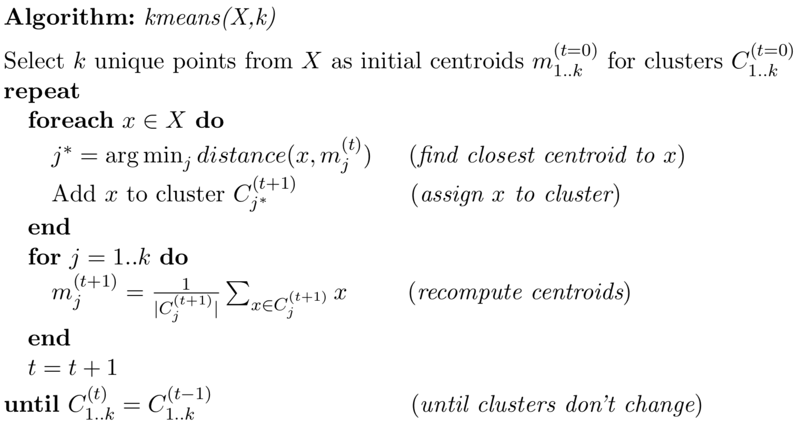
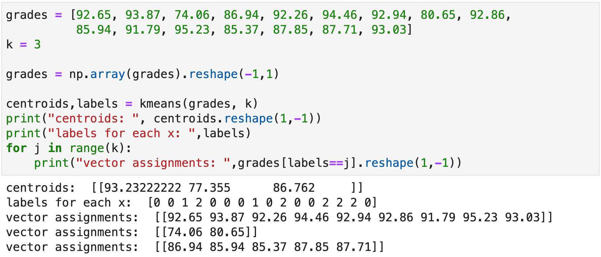
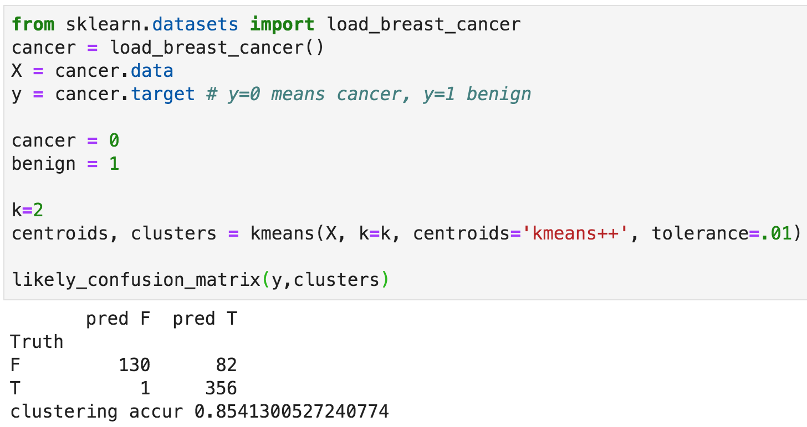
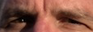
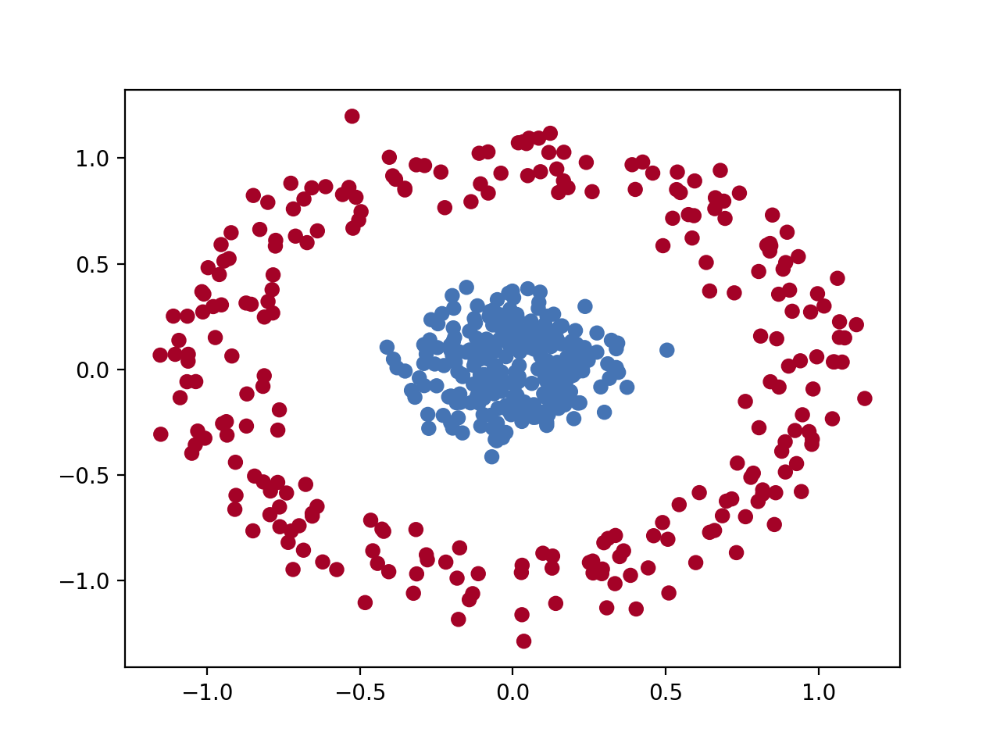
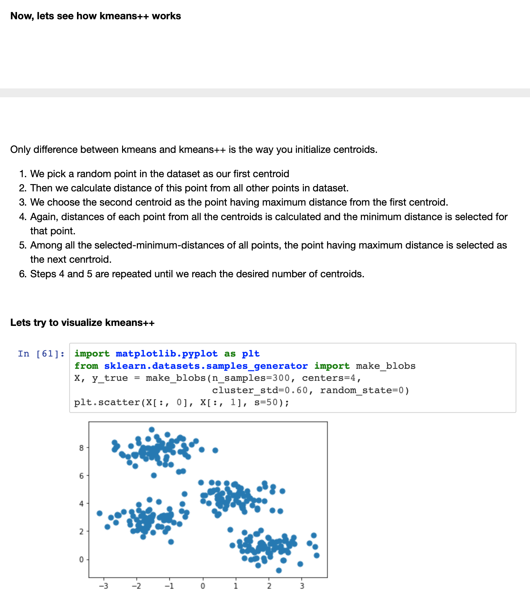
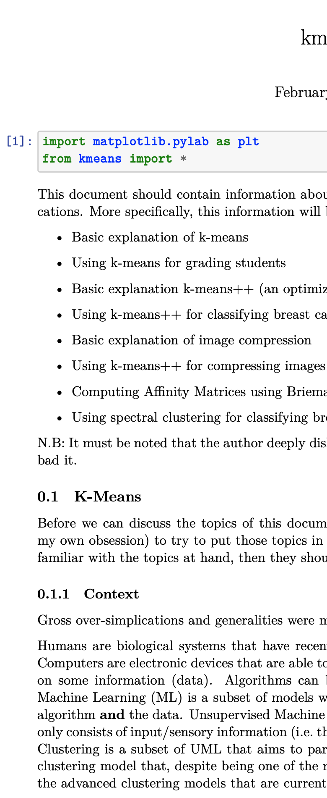
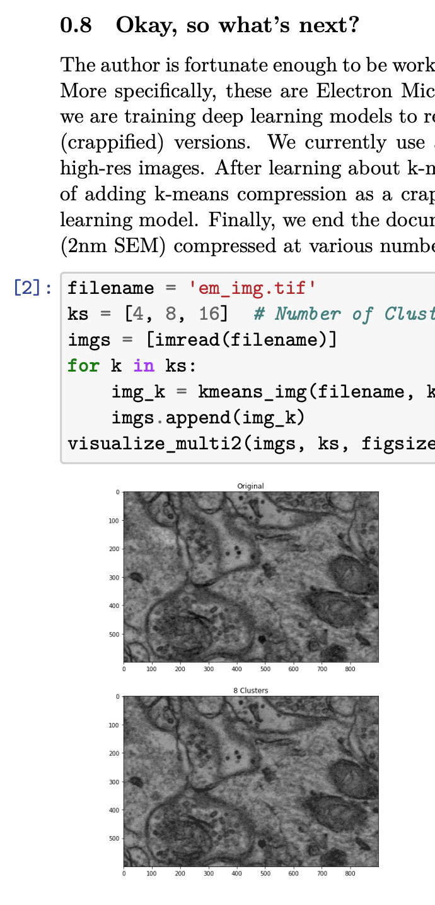
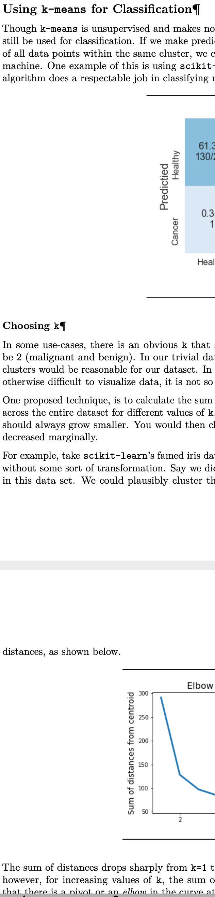

# Clustering extravaganza

The goal of this project is to get more practice implementing algorithms, as well as translating pseudocode algorithms to Python. This project is also very loosely defined as it is meant to be much more realistic. Previously, I very carefully laid out exactly the process for you to follow. Now, you will have to think about the whole problem and plan your approach. Further, the exact assessment rubric is not specified. Your goal is to produce a notebook (and submit a PDF version) that is a kind of report or tutorial you might publish, detailing your exploration of kmeans and other clustering algorithms. This will be useful artifact to send to potential employers.  (*But, please don't post your results publicly on the Internet as I will likely use these projects in the future*.) With probability 92.5%, you will be asked to describe kmeans clustering during interviews.

The kmeans-related algorithms were surprisingly challenging to get working because there are a number of pitfalls that can take a while to debug. 

You will work under `kmeans-`*userid* repo.

**Warning:** You must implement your own code here, despite there being a billion implementations available for you to read on the Internet. The goal is for you to learn as much as possible from this course. You will get out of this what you put into it.

## kmeans

First, you should implement the standard kmeans algorithm:



and put into file `kmeans.py` in root directory of your repo.  You can import that file into your notebook using the following from one of the cells:

```
%run kmeans
```

Your function can follow an interface like this but you can do what you want:

```python
def kmeans(X:np.ndarray, k:int, centroids=None, max_iter=30, tolerance=1e-2):
    ...
    return centroids, labels
```

where `centroids` is an *k* x *p* matrix containing the *k* centroids (vectors are *p* long). The `labels` return value is a list of length *n* the label associated with each input vector. I use the tolerance as a general guideline for comparing previous and next generation centroids. If the average norm of centroids-previous_centroids is less than the tolerance, I stop.  I also have `max_iter` as a failsafe to prevent it from going too long. By default, `centroids=None` indicates that your algorithm should randomly select *k* unique centroids. 

### Testing on some synthetic data

Here's a sample run on one dimensional data using some fake grade data:



Your software must also handle more than one dimensional data. For example, on the cancer data set there are *p*=30 features.

As a *p*>1 test, let's generate two synthetic distributions, one nested in the other. As you can see, kmeans performs poorly on disjoint and nested structures:

```python
from sklearn.datasets import make_circles
import matplotlib.pyplot as plt

from kmeans import *

X, _ = make_circles(n_samples=500, noise=0.1, factor=.2)
centroids, labels = kmeans(X, 2, centroids='kmeans++')
print(centroids)
colors=np.array(['#4574B4','#A40227'])
plt.scatter(X[:,0], X[:,1], c=colors[labels])
plt.show()
plt.savefig("/Users/parrt/Desktop/nested-kmeans.png", dpi=200)
```


If `centroids='kmeans++'` then your algorithm should use the kmeans++ mechanism for selecting initial centroid, as described next. 


## kmeans++

You must find the kmeans++ initial centroid identification algorithm somewhere on the web and implement that in your kmeans.py file.  Actually those get complicated, estimated joint density etc... Not necessary. The basic idea is just to randomly pick the first of *k* centroids. Then, pick next *k*-1 points by selecting points that maximize the minimum distance to all existing cluster centroids. So for each point, compute the minimum distance to each cluster.  Among those min distances to clusters for each point, find the max distance. The associated point is the new centroid.

```
def select_centroids(X,k):
    """
    kmeans++ algorithm to select initial points:

    1. Pick first point randomly
    2. Pick next k-1 points by selecting points that maximize the minimum
       distance to all existing clusters. So for each point, compute distance
       to each cluster and find that minimum.  Among the min distances to a cluster
       for each point, find the max distance. The associated point is the new centroid.

    Return centroids as k x p array of points from X.
    """
```

Here's a sample run on the cancer data set for me:



You will notice that I have generated a confusion matrix but how do we know which centroid is associated with which true label (we don't have the *y* target to work with during clustering)?  What I do is to find the most common prediction in each cluster and then assume that is the prediction, flipping each element in that cluster to the appropriate label. Then, we can compare those results to the known *y*.

## Application to image compression

In the introduction to machine learning course, we looked at the application of clustering to image compression. Rather than use millions of colors, we can usually get away with 256 or even 64 colors. The key is choosing the right colors that are representative for that image. The way to do that is to cluster in *p*=3 space for (red,green,blue) vectors. But, it's a good idea to start with grayscale.

### Greyscale

Here's an original [picture from North Africa](north-africa-1940s-grey.png) taken by my father during World War II and one with just k=4 levels of gray (takes mine 45s to compute):


My code looks something like this:

```python
k=4
centroids, labels = kmeans(X, k=k, centroids='kmeans++', tolerance=.01, verbose=True)
centroids = centroids.astype(np.uint8)
X = centroids[labels] # reassign all points

img_ = Image.fromarray(X.reshape(h,w), 'L')
img_.show()
```

I strongly recommend that you start out with a very small grayscale image to test your code and to speed up the debugging cycle.
 
### Color

As an example of color compression, here is your [favorite instructor](parrt-vancouver.jpg) in Vancouver as a disembodied head visiting Chinatown and a compressed version that uses only 32 colors (takes mine 3m18s to complete limited to 30 iterations):


Here is what my code looks like:

```python
k=32
centroids, labels = kmeans(X, k=k, centroids='kmeans++', max_iter=30)
centroids = centroids.astype(np.uint8)
X = centroids[labels] # reassign all points

img_ = Image.fromarray(X.reshape((h,w,3)))
img_.show()
```

For testing, I cut out and used my [eyes](eyes.png) from that Vancouver shot. 

## Spectral clustering

In the introduction of machine learning, we briefly mentioned spectral clustering as a possible more advanced clustering mechanism.  By reading the web and possibly using content from another MSDS class, you can investigate using spectral clustering. For example, here is a much better clustering of the nested distributions that kmeans failed to handle well:

```
cluster = SpectralClustering(n_clusters=2, affinity="nearest_neighbors")
labels = cluster.fit_predict(X)  # pass X not similarity matrix

print(labels)
colors=np.array(['#4574B4','#A40227'])
plt.scatter(X[:,0], X[:,1], c=colors[labels])
plt.savefig("/Users/parrt/Desktop/nested-spectral.png", dpi=200)
plt.show()
```



That example uses a built-in mechanism called "nearest neighbors" to compute the distance between all pairs of records. When there is categorical data or the number of dimensions gets very high, Euclidean and similar distance measures are inappropriate. To solve this last from, see the next section.

### Advanced: using RFs to compute similarity matrices

We also discussed how to use random forests in an unsupervised way to get a similarity or distance metric from observation *i* to observation *j*. This information is not directly useful in k-means because the means are not typically observations (they are the means of a cluster of them). That means we can't measure the distance of a point to a cluster. Instead, we can use spectral clustering, which can accept a similarity matrix. It does some linear algebra magic and then clusters a transformed space using its own kmeans. I used sklearn's built-in mechanism:

```python
S = similarity_matrix(X) # breiman's trick
cluster = SpectralClustering(n_clusters=2, affinity='precomputed')
cluster.fit_predict(S) # pass similarity matrix not X
```

And then got a confusion matrix for the cancer data set:

```
       pred F  pred T
Truth                
F         196      16
T          31     326
clustering accur 0.9173989455184535
```

Using kmeans gets a similar result, but it's a good check to see if your similarity matrix coming out of the random forest is correct.

### Breiman's RF for unsupervised learning trick

See [Breiman's website](https://www.stat.berkeley.edu/~breiman/RandomForests/cc_home.htm#prox) for the idea behind getting a proximity matrix from random forests. To save you the trouble of learning how sklearn implements random forests, here is a function that will get you all of the samples at the leaves reached by some input matrix X:

```python
def leaf_samples(rf, X:np.ndarray):
    """
    Return a list of arrays where each array is the set of X sample indexes
    residing in a single leaf of some tree in rf forest. For example, if there
    are 4 leaves (in one or multiple trees), we might return:

        array([array([0, 1, 2, 3, 4, 5, 6, 7, 8, 9]),
               array([10, 11, 12, 13, 14, 15]), array([16, 17, 18, 19, 20]),
               array([21, 22, 23, 24, 25, 26, 27, 28, 29]))
    """
    n_trees = len(rf.estimators_)
    leaf_samples = []
    leaf_ids = rf.apply(X)  # which leaf does each X_i go to for sole tree?
    for t in range(n_trees):
        # Group by id and return sample indexes
        uniq_ids = np.unique(leaf_ids[:,t])
        sample_idxs_in_leaves = [np.where(leaf_ids[:, t] == id)[0] for id in uniq_ids]
        leaf_samples.extend(sample_idxs_in_leaves)
    return leaf_samples
```

## Deliverables

1. You must provide `kmeans.py` in root directory of your repo. This should include all of your algorithm implements and support code.
2. You must submit a notebook called `kmeans.ipynb` with the associated PDF generated from it to ease our grading, `kmeans.pdf`.  The notebook should be a report, not a dump of your code.

## Assessment

I will be scanning through your reports, so grading could take take significantly longer than when I provide you some unit tests. Sorry in advance. Also, given the wide range of reports that you will submit, I will limit myself to one of three grades check, check minus, check minus minus, corresponding roughly to A, B, C.

You should also think about explaining how all of your algorithms work, including how you identify which cluster centroids should be associated with which true labels. Talk about any extra stuff you've done and other tests. Ask yourself what you don't know and what you'd like to learn at the start of this project. Then those are good questions to ask and answer in your report notebook. Try to create something that you will be proud to show potential employers.

You should submit a well-written and well-organized report, not a junk drawer of crap you were working on when the deadline hit. ;)

### Sample report snippets from previous students

To give you an idea of what decent reports look like, here are some snippets:

    