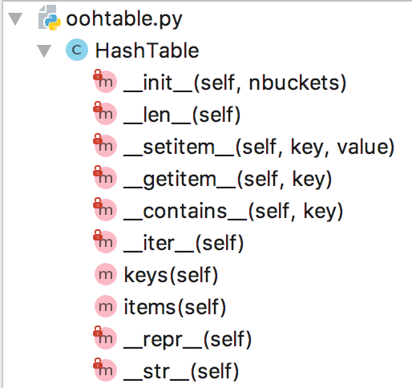

# OO Search Engine Implementation

In [MSDS962](https://github.com/parrt/msds692/blob/master/hw/search.md) you learned how to create and use a hash table. You did so by using non-object-oriented programming; i.e., just a bunch of functions. In this homework, your will build an object-oriented version of the hash table project. You will see that the object-oriented version is much more user-friendly and that it behaves very much like the built-in `dict` class.

Rather than updating your own original code base, you will download and update a previous student's code. I have provided everyone with a common `htable.py` to start with (rename it to `oohtable.py`); please see the files area on Canvas. This will give you an opportunity to read somebody else's code from a few years ago. It's more or less okay but not very pretty. You are free to improve the code quality as you add features and convert it to an object-oriented version in this project. Learning to read and modify somebody else's code is a critical skill to gain in order to be productive at work.

As you work on this project, I encourage you reflect on:

* How easy is it to understand someone else's code? 
* Is it hard to read without comments?
* How easy is it to your own code a few months later? 
* Do you regret not adding more comments?
* Would you use different variable names now?
* Could you improve your code, given your enhanced experience?

For more on object oriented programming, you can check out these [OO review notes](https://github.com/parrt/msds501/blob/master/notes/OO.ipynb) and this [practice quiz for OO](https://github.com/parrt/msds689/blob/master/labs/quiz-oo.ipynb).

## Discussion and requirements

Using the hash table we created in MSDS692 was a bit awkward. For example, here is how we created a hash table with 5 buckets and stored 99 at the key `parrt`:

```python
table = htable(5)
htable_put(table, "parrt", 99)
```

For this project, you are going to build a class definition called `HashTable` in file `oohtable.py` so that we can say the following instead:

```python
table = HashTable(5)
table["parrt"] = 99
```

Similarly, to fetch something out of the table, we used to have to say:

```python
x = htable_get(table, "parrt")
```

But, now we can use the indexing operator:

```python
x = table["parrt"]
```

Your implementation of `HashTable` must define methods `__setitem__` and `__getitem__` to implement these operators (see operator overloading discussion).

To count the elements within the hash table we want to be able to use `len(table)`. To do that, you have to implement the `__len__` method. Note this is counting the number of elements among all of the buckets, not the number of buckets.

To iterate through the keys of your hash table like this:

```python
for k in table:
    print(k)
```

you need to implement the `__iter__` method.  That method can return a so-called generator expression that iterates over the `keys()`.

To test for membership of a key like this:

```
if 'parrt' in table:
    print("woot!")
```

you must implement `__contains__`.

To get a list of the keyvalue pairs as tuples like `[('the', 9), ('and', 9), ...]`, implement the `items` method.

As with a built-in dictionary from Python, converting something to string using `str(table)` or just `print(table)` should also work. That means you have to implement the `__str__` method to print out the key:value pairs. We also had a method that dumped out all the buckets for debugging purposes called `htable_buckets_str()`.  Instead, we use `__repr__` with the class definition to print out a representation of that object.

**You must support any object as key, not just strings and integers**, whereas, in MSDS692 we restricted the type of keys. Use the built in `hash(o)` function to get hashcodes for key objects.

Here are all of the methods that you must implement in the class definition:



Of course you can implement other methods, but those are the ones used by the test rig. (My class also has `hashcode()`, for example.)

Please note that you cannot have any global variables, variable sitting outside of your class or method definitions. You can only have local variables, parameters of functions, and fields of the `HashTable` class.

Your `oohtable.py` file also should not have code that gets executed when other files import `oohtable.py`.  

The tests described in the next section should execute very quickly, as in less than a second.

## Evaluation

To evaluate your projects, I will run the unit tests.  The unit tests I have provided for you test all of the functions described above, except for the "keys can be any kind of object" part. Because the tests all use the index notation, `table[key]`, you should get `__setitem__` and `__getitem__` working first.

I have created a small hidden test for your hashtable.  Make sure your test performance is O(1) even on big hashtables.

We will grade in a binary fashion (works or doesn't) because you have most of the known tests.  Each failed test costs you 5%. Each failed hidden test costs you 3%.

Please make a copy of [test_oohtable.py](test_oohtable.py) in the same directory as your `oohtable.py` file and then run your tests either from your development environment or the command line.  Of course, you can also use github actions as we did in the previous semester. Ultimately, you want the test results to look like the following:

```
$ python -m pytest -v test_oohtable.py 
======================================== test session starts =========================================
platform darwin -- Python 3.8.6, pytest-6.2.2, py-1.10.0, pluggy-0.13.1 -- /Users/parrt/opt/anaconda3/bin/python
cachedir: .pytest_cache
rootdir: /Users/parrt/courses/msds689-private/projects/oohtable
plugins: anyio-2.0.2, xdist-2.2.1, repeat-0.9.1, forked-1.3.0
collected 18 items                                                                                 

test_oohtable.py::test_empty PASSED                                                          [  5%]
test_oohtable.py::test_single PASSED                                                         [ 11%]
test_oohtable.py::test_get0 PASSED                                                           [ 16%]
test_oohtable.py::test_get PASSED                                                            [ 22%]
test_oohtable.py::test_singleton PASSED                                                      [ 27%]
test_oohtable.py::test_int_to_int PASSED                                                     [ 33%]
test_oohtable.py::test_str_to_str PASSED                                                     [ 38%]
test_oohtable.py::test_str_to_list PASSED                                                    [ 44%]
test_oohtable.py::test_replace_str PASSED                                                    [ 50%]
test_oohtable.py::test_len0 PASSED                                                           [ 55%]
test_oohtable.py::test_len PASSED                                                            [ 61%]
test_oohtable.py::test_items0 PASSED                                                         [ 66%]
test_oohtable.py::test_items PASSED                                                          [ 72%]
test_oohtable.py::test_iter0 PASSED                                                          [ 77%]
test_oohtable.py::test_iter PASSED                                                           [ 83%]
test_oohtable.py::test_keys0 PASSED                                                          [ 88%]
test_oohtable.py::test_keys PASSED                                                           [ 94%]
test_oohtable.py::test_wordfreq PASSED                                                       [100%]
============================== 18 passed in 0.32s ==============================
```

## Deliverables

You must complete and add the following file to the root of your `oohtable-`*userid* repository in the USF-MSDS689 organization.

* `oohtable.py`
